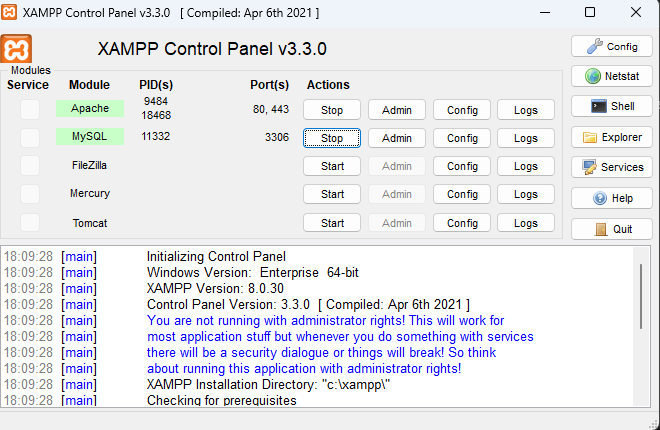
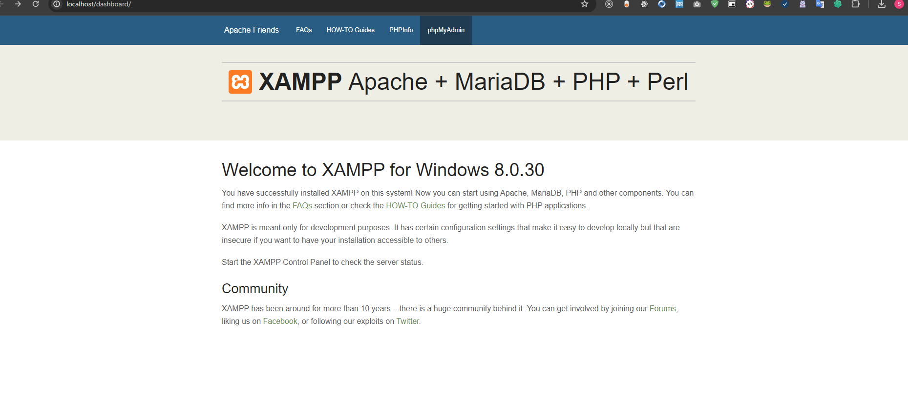
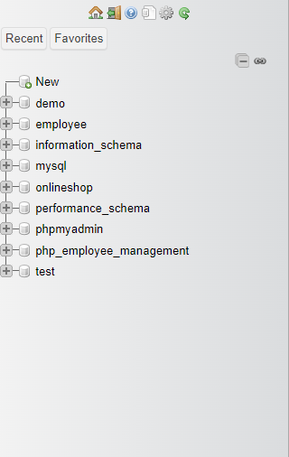
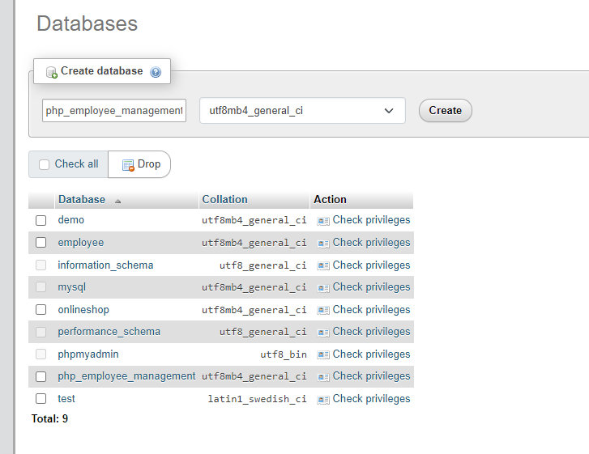
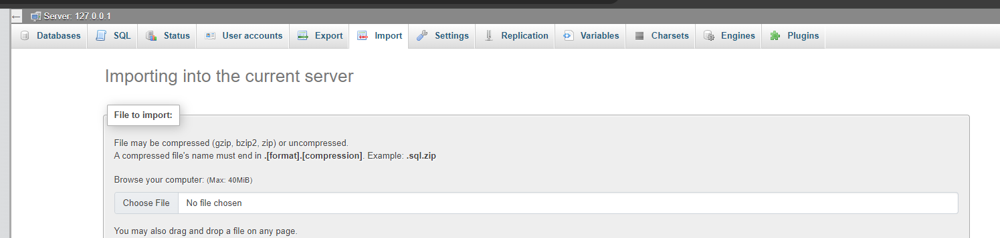
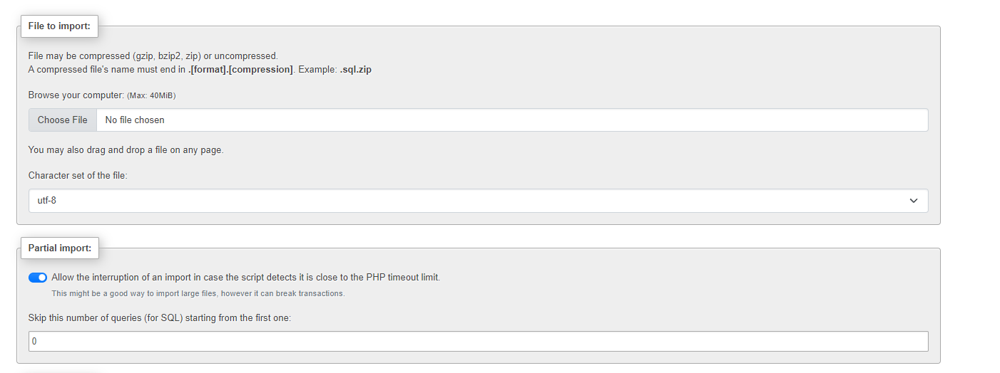
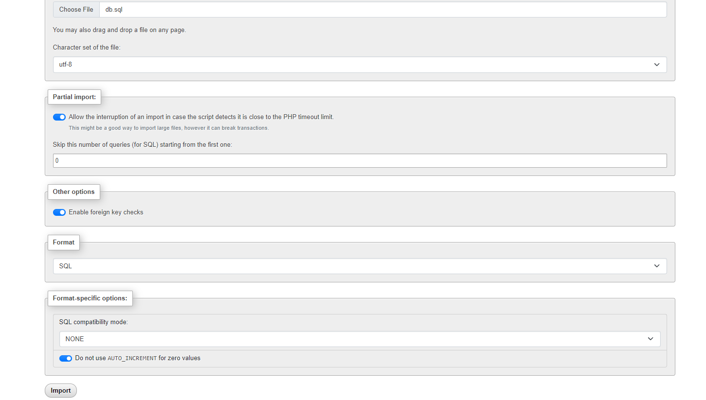
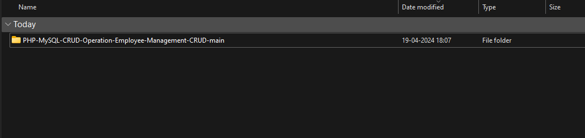

### Step 1 : start apache and mysql both



### step 2 : go to the browser and paste the url

```
http://localhost
```

### step 3 : click on PhpMyadmin



### step 4 : click on new



### step 5 : give the database name

```
php_employee_management
```



then click on create

### step 6 : click on import



### step 7 : click on choose file



### step 8 : choose the db.sql file then click on import button



### step 9 : copy the folder



### step 10 : go to the xampp location and paste this folder into the htdocs

paste the browser

```
http://localhost/PHP-MySQL-CRUD-Operation-Employee-Management-CRUD-main
```
